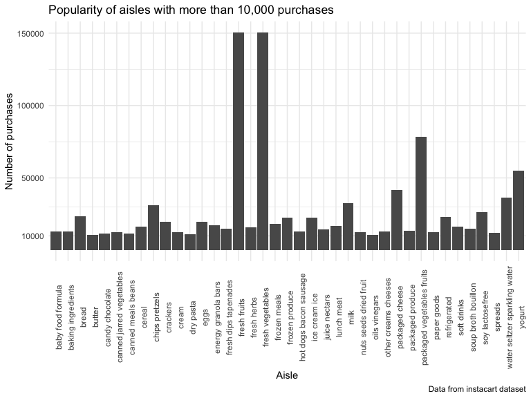
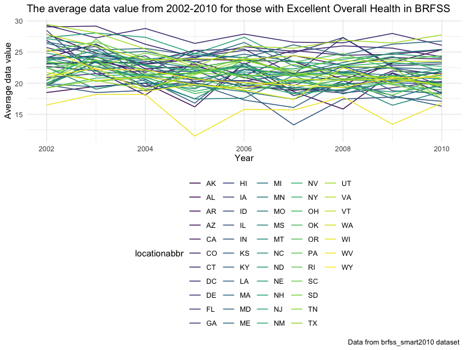
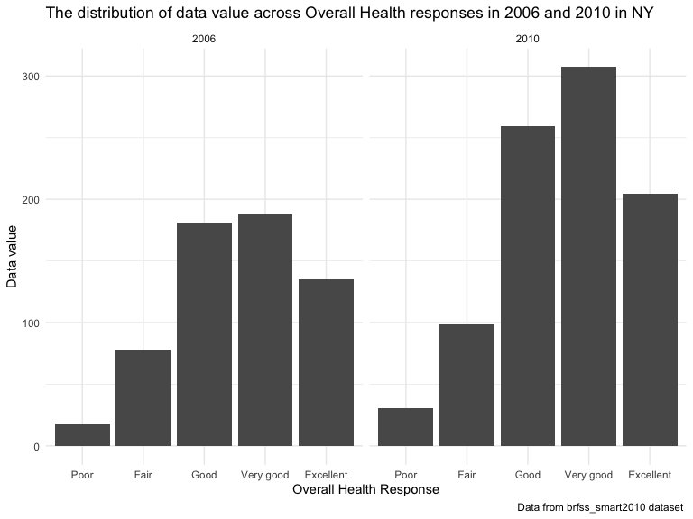
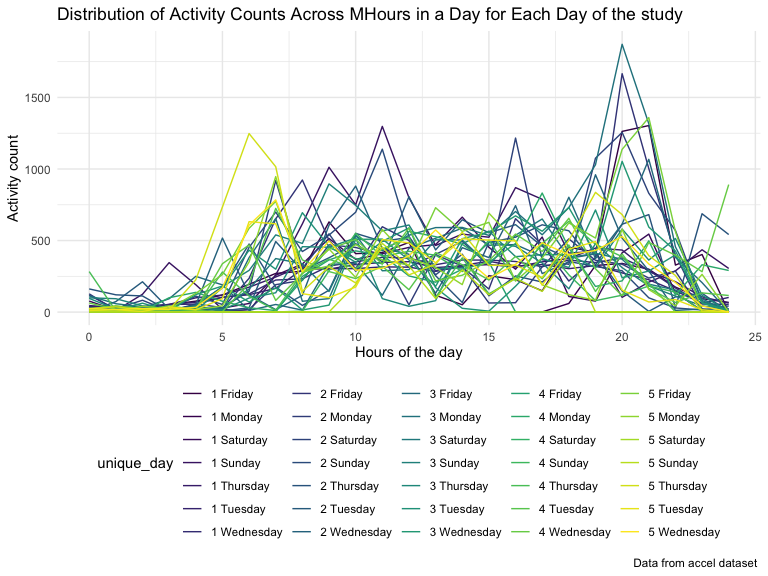
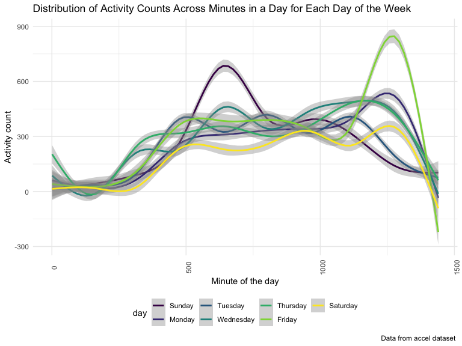

p8105\_hw3\_tb2715
================
Tess
10/5/2019

\#\#Question 1

``` r
library(p8105.datasets)
data("instacart") 
```

The instacart data set contains 1384617 rows and 15 columns. The columns
consist of information collected from a grocery store on it’s most
popular items and what time the groceries were purchased. Notably, some
of these variables are :

`order_dow`: which specifies the day of the week the order was placed
`aisle_id`: the unique aisle in which the product was found
`order_hour_of_day`: the time the order was made `product_name`: item
that was purchased `department`: grocery department where the purchased
item was located

Based on the dataset and headings, we can determine that as part of user
112108’s purchase, they bought Bulgarian yogurt on the 4th day of the
week, 10th hour of the day. It was 9 days since their prior order.
Additionally, they had purchased this item before and it was located
from the yogurt aisle in the dairy/eggs department.

\#identify number of aisles

``` r
n_distinct(pull(instacart, aisle_id))
```

    ## [1] 134

\#arrange aisles by number of goods in an aisle

``` r
instacart %>%
  group_by(aisle) %>%
  summarize(n_obs = n()) %>%
  arrange(desc(n_obs))
```

    ## # A tibble: 134 x 2
    ##    aisle                          n_obs
    ##    <chr>                          <int>
    ##  1 fresh vegetables              150609
    ##  2 fresh fruits                  150473
    ##  3 packaged vegetables fruits     78493
    ##  4 yogurt                         55240
    ##  5 packaged cheese                41699
    ##  6 water seltzer sparkling water  36617
    ##  7 milk                           32644
    ##  8 chips pretzels                 31269
    ##  9 soy lactosefree                26240
    ## 10 bread                          23635
    ## # … with 124 more rows

There are 134 aisles in this data set. The fresh vegetable, fresh fruit,
and packaged vegetable fruit aisles have the most items ordered from
them in that respective order.

\#plot of aisles with more than 10,000 items.

``` r
instacart %>%
  group_by(aisle) %>%
  summarize(n_obs = n()) %>% 
  filter(n_obs > 10000) %>%
  ggplot(aes(x = aisle, y = n_obs)) +
  geom_col() +
  theme(axis.text.x = element_text(angle = 90)) +
    labs(
    title = "Popularity of aisles with more than 10,000 purchases",
    x = "Aisle",
    y = "Number of purchases",
    caption = "Data from instacart dataset"
  ) + 
    scale_y_continuous(
    breaks = c(10000, 50000, 100000, 150000), 
    labels = c("10000", "50000", "100000", "150000"))
```



The fresh vegetable, fresh fruit, and packaged vegetable fruit aisles
tower above the other products in the plot. Many of the aisles sold
close to 10,000 items.

\#table of the most popular items “baking ingredients”, “dog food care”,
and “packaged vegetables fruits”

``` r
instacart %>%
  filter(aisle == "baking ingredients" | aisle == "dog food care" | aisle == "packaged vegetables fruits") %>%
  group_by(aisle, product_name) %>%
  summarize(n_obs = n()) %>%
  mutate(ranking = rank(-n_obs)) %>%
  filter(ranking <= 3) %>%
  arrange(aisle, ranking) %>%
  knitr::kable()
```

| aisle                      | product\_name                                 | n\_obs | ranking |
| :------------------------- | :-------------------------------------------- | -----: | ------: |
| baking ingredients         | Light Brown Sugar                             |    499 |       1 |
| baking ingredients         | Pure Baking Soda                              |    387 |       2 |
| baking ingredients         | Cane Sugar                                    |    336 |       3 |
| dog food care              | Snack Sticks Chicken & Rice Recipe Dog Treats |     30 |       1 |
| dog food care              | Organix Chicken & Brown Rice Recipe           |     28 |       2 |
| dog food care              | Small Dog Biscuits                            |     26 |       3 |
| packaged vegetables fruits | Organic Baby Spinach                          |   9784 |       1 |
| packaged vegetables fruits | Organic Raspberries                           |   5546 |       2 |
| packaged vegetables fruits | Organic Blueberries                           |   4966 |       3 |

The most popular item in the dog food care aisle is sold 300x less than
the most popular item from packaged fruits vegetables. Baby spinach is
the most popular item by far of these three aisles. Small dog biscuits
is the least popular item from this table.

\#table of the mean hour of the day when Pink Lady apples and Coffee are
bought each day of the week

``` r
instacart %>%
  filter(product_name == "Pink Lady Apple" | product_name == "Coffee Ice Cream") %>%
  group_by(product_name, order_dow) %>%
  summarize(mean_hour_of_day = mean(order_hour_of_day)) %>%
  pivot_wider(
    names_from = order_dow,
    values_from = mean_hour_of_day) %>%
  knitr::kable()
```

| product\_name    |        0 |        1 |        2 |        3 |        4 |        5 |        6 |
| :--------------- | -------: | -------: | -------: | -------: | -------: | -------: | -------: |
| Coffee Ice Cream | 13.77419 | 14.31579 | 15.38095 | 15.31818 | 15.21739 | 12.26316 | 13.83333 |
| Pink Lady Apple  | 14.40000 | 14.20000 | 13.20000 |  8.00000 | 11.00000 | 16.00000 | 13.00000 |

Pink Lady Apples and Coffee Ice cream are fairly comparable across the
week. It is interesting to note that the largest difference in purchases
is on day 3. In this dataset, the day that they are closest in
popularity is day 1.

\#\#Question 2

``` r
data("brfss_smart2010") 

#rename dataset and clean names/data
brfss =
  janitor::clean_names(brfss_smart2010)  %>%
  filter(topic == "Overall Health") %>% 
  filter(response == "Excellent" | response == "Very good" | response == "Good" | response == "Fair" | response == "Poor") %>%
  mutate(respone = as.factor(response),
  response = forcats::fct_relevel(response, c("Poor", "Fair", "Good", "Very good", "Excellent")))
```

\#States observed at 7 or more locations

``` r
#states with 7 or more testing locations in 2002
brfss %>% 
  filter(year == "2002") %>%
  group_by(locationabbr) %>%
  distinct(locationdesc) %>%
  summarize(total_testing_location = n()) %>%
  filter(total_testing_location >= 7) %>%
  arrange(total_testing_location) %>%
  knitr::kable(digits = 1)
```

| locationabbr | total\_testing\_location |
| :----------- | -----------------------: |
| CT           |                        7 |
| FL           |                        7 |
| NC           |                        7 |
| MA           |                        8 |
| NJ           |                        8 |
| PA           |                       10 |

``` r
#states with 7 or more testing locations in 2010
brfss %>% 
  filter(year == "2010") %>%
  group_by(locationabbr) %>%
  distinct(locationdesc) %>%
  summarize(total_testing_location = n()) %>%
  filter(total_testing_location >= 7) %>%
  arrange(total_testing_location) %>%
  knitr::kable(digits = 1)
```

| locationabbr | total\_testing\_location |
| :----------- | -----------------------: |
| CO           |                        7 |
| PA           |                        7 |
| SC           |                        7 |
| OH           |                        8 |
| MA           |                        9 |
| NY           |                        9 |
| NE           |                       10 |
| WA           |                       10 |
| CA           |                       12 |
| MD           |                       12 |
| NC           |                       12 |
| TX           |                       16 |
| NJ           |                       19 |
| FL           |                       41 |

There were more states tested at 7 or more locations in 2010 than were
tested in 2002. Not all of the same states were tested at 7 or more
locations between the 2 years. For example, CT had 7 testing locations
in 2002 but fewer than this in 2010 and therefore did not make the list.

\#Excellent response data from brfss

``` r
#create dataset for excellent data
excellent_data = 
brfss %>% 
  filter(response == "Excellent") %>%
  group_by(locationabbr, year) %>%
  mutate(mean_data_value = mean(data_value, na.rm = TRUE)) 

#create spaghetti plot of the excellent responses
excellent_data %>%    
ggplot(aes(x = year, y = mean_data_value, group = locationabbr, color = locationabbr)) + 
  geom_line() +
  labs(
    title = "The average data value from 2002-2010 for those with Excellent Overall Health in BRFSS",
    x = "Year",
    y = "Average data value",
    caption = "Data from brfss_smart2010 dataset "
  )
```



It is difficult to determine a pattern from the excellent response data.
West Virginia data values fell dramatically in 2005, but otherwise the
data is fairly clustered together.

\#dual plot of 2006 and mean\_data\_value vs response

``` r
brfss %>%
  filter(year == "2006" | year == "2010",
         locationabbr == "NY") %>%
  ggplot(aes(x = response, y = data_value)) +
  geom_col() +
  facet_wrap(~year) + 
    labs(
    title = "The distribution of data value across Overall Health responses in 2006 and 2010 in NY",
    x = "Overall Health Response",
    y = "Data value",
    caption = "Data from brfss_smart2010 dataset "
  )
```



Those who responded “very good” to the overall health survey question
have a higher data value in both 2006 and 2010. Those who responded
“poor” have a much lower data value in both 2006 and 2010.

\#\#Question 3

``` r
accel = read_csv(file = "./data/accel_data.csv")
```

    ## Parsed with column specification:
    ## cols(
    ##   .default = col_double(),
    ##   day = col_character()
    ## )

    ## See spec(...) for full column specifications.

``` r
accel_tidy =  
  janitor::clean_names(accel) %>%
  mutate(weekend = if_else(day == "Saturday" | day == "Sunday", "weekend", "weekday")) %>%
  pivot_longer(
    activity_1:activity_1440, 
    names_to = "activity", 
    values_to = "activity_counts") %>%
  separate(activity, into = c("activity", "minute")) %>%
  select(-activity) %>%
  mutate(
    minute = as.numeric(minute), 
    day = as.factor(day), 
    day = forcats::fct_relevel(day, c("Sunday", "Monday", "Tuesday", "Wednesday", "Thursday", "Friday", "Saturday")))
```

The accel data set contains 50400 rows and 6 columns. The columns
consist of information collected from an accelerometer on a 63 year old
male, with a BMI of 25 who was admitted to CUMC with congestive heart
failure. Notably, some of the variables in this dataset are:

`day_id`: the day accelerometer data was collected `activity`: an
activity count corresponding to individual minutes of the day. `week`:
the week accelerometer data was collected `weekend`: differentiates
information collected on a weekend vs weekday

\#aggregate across a day to create total activity variable

``` r
accel_tidy %>%
  group_by(day_id) %>%
  summarize(total_activity = sum(activity_counts)) %>%
  knitr::kable()
```

| day\_id | total\_activity |
| ------: | --------------: |
|       1 |       480542.62 |
|       2 |        78828.07 |
|       3 |       376254.00 |
|       4 |       631105.00 |
|       5 |       355923.64 |
|       6 |       307094.24 |
|       7 |       340115.01 |
|       8 |       568839.00 |
|       9 |       295431.00 |
|      10 |       607175.00 |
|      11 |       422018.00 |
|      12 |       474048.00 |
|      13 |       423245.00 |
|      14 |       440962.00 |
|      15 |       467420.00 |
|      16 |       685910.00 |
|      17 |       382928.00 |
|      18 |       467052.00 |
|      19 |       371230.00 |
|      20 |       381507.00 |
|      21 |       468869.00 |
|      22 |       154049.00 |
|      23 |       409450.00 |
|      24 |         1440.00 |
|      25 |       260617.00 |
|      26 |       340291.00 |
|      27 |       319568.00 |
|      28 |       434460.00 |
|      29 |       620860.00 |
|      30 |       389080.00 |
|      31 |         1440.00 |
|      32 |       138421.00 |
|      33 |       549658.00 |
|      34 |       367824.00 |
|      35 |       445366.00 |

It appears that in later weeks of the study, activity levels drop to
only 1 activity count per minute on Saturdays. This is true in week 4
and week 5.

\#create plot to show fluctuation over each day

``` r
#fluctuation in activity counts over the hours in each day
accel_tidy %>%
  mutate(
    hour = minute %/% 60,
    hour = as.integer(hour),
    unique_day = paste(week, day)) %>%
  group_by(unique_day, hour) %>%
  summarize(mean_activity_counts = mean(activity_counts)) %>%
    ggplot(aes(x = hour, y = mean_activity_counts, color = unique_day)) +
             geom_line() + 
      labs(
    title = "Distribution of Activity Counts Across Minutes in a Day for Each Day of the study",
    x = "Hours of the day",
    y = "Activity count",
    caption = "Data from accel dataset "
  )
```



``` r
#average activity level throughout the day based on days of the week
accel_tidy %>%
  group_by(day_id) %>%
  ggplot(aes(x = minute, y = activity_counts, color = day)) +
   geom_smooth() +
   theme(axis.text.x = element_text(angle = 90))  + 
    labs(
    title = "Distribution of Activity Counts Across Minutes in a Day for Each Day of the Week",
    x = "Minute of the day",
    y = "Activity count",
    caption = "Data from accel dataset "
  )
```

    ## `geom_smooth()` using method = 'gam' and formula 'y ~ s(x, bs = "cs")'



``` r
#weekend vs weekday comparison of activity levels
accel_tidy %>%
  group_by(weekend) %>%
  ggplot(aes(x = minute, y = activity_counts, color = weekend)) +
   geom_smooth() +
   theme(axis.text.x = element_text(angle = 90))  + 
    labs(
    title = "Distribution of Activity Counts Across Minutes in a Day for All Days",
    x = "Minute of the day",
    y = "Activity count",
    caption = "Data from accel dataset "
  )
```

    ## `geom_smooth()` using method = 'gam' and formula 'y ~ s(x, bs = "cs")'


A decline in activity level is seen for all days after the 1250 minute
of the day. The activity levels remain low for the first 250 minutes of
the day as the individual is likely sleeping. It does appear that the
individual has the lowest activity levels observed on Saturdays than
during the weekdays.
